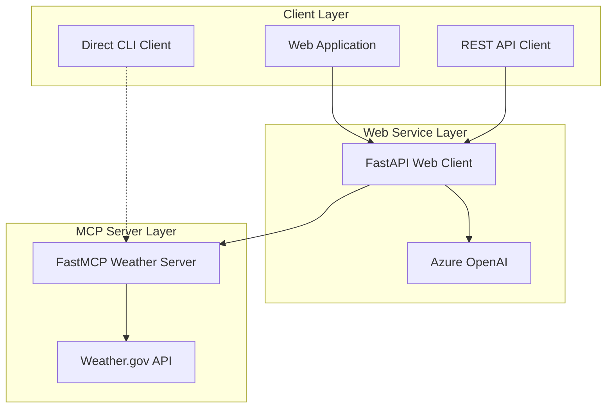

# MCP Tutorial Architecture Guide

## Project Overview

This MCP (Model Context Protocol) tutorial demonstrates a complete end-to-end implementation of a weather service using modern Python development practices.

## Architecture Components



## Component Details

### 1. MCP Weather Server (`/server`)
- **Framework**: FastMCP
- **Transport**: Dual support (stdio/SSE)
- **API Integration**: National Weather Service
- **Tools**:
  - `get_alerts(state)` - State weather alerts
  - `get_forecast(lat, lon)` - Location forecasts

### 2. Web Client Service (`/web_client`)
- **Framework**: FastAPI
- **Features**: Session management, conversation memory
- **Integration**: Azure OpenAI, MCP Server
- **Endpoints**:
  - `POST /chat` - Simple queries
  - `POST /chat/session/{id}` - Session-based chat
  - `GET /health` - Service health check

### 3. Direct Clients (`/client`)
- **stdio_client.py**: Direct MCP connection
- **sse_client.py**: HTTP-based connection with memory
- **Interactive CLI**: For testing and development

## Data Flow

1. **User Query** → Web Client → Azure OpenAI
2. **Tool Decision** → Azure OpenAI determines weather tool needed
3. **Tool Execution** → Web Client calls MCP Server
4. **Weather Data** → MCP Server fetches from NWS API
5. **Response Assembly** → Azure OpenAI processes results
6. **Final Response** → Returned to user

## Development Workflow

### Local Development
```bash
# Terminal 1: Start MCP server
cd server
uv run python weather.py sse

# Terminal 2: Start web client
cd web_client
uv run uvicorn main:app --reload --port 8080

# Terminal 3: Test
curl http://localhost:8080/health
```

### Docker Development
```bash
# Use development compose with hot reload
docker-compose -f docker-compose.yml -f docker-compose.dev.yml up
```

### Production Deployment
```bash
# Use production compose
docker-compose up -d
```

## Configuration Management

### Environment Variables
- **Development**: `.env` files (gitignored)
- **Production**: Environment injection
- **Template**: `.env.example` for setup

### Required Variables
```bash
# Azure OpenAI
AZURE_OPENAI_API_BASE=https://your-resource.openai.azure.com/
AZURE_OPENAI_API_KEY=your-api-key
AZURE_OPENAI_API_VERSION=2024-08-01-preview
AZURE_OPENAI_DEPLOYMENT_NAME=your-deployment

# MCP Server
MCP_SERVER_URL=http://localhost:8000/sse
```

## Security Considerations

### ✅ Implemented
- Input validation with Pydantic
- Safe JSON parsing (no eval())
- Non-root Docker containers
- CORS configuration
- Proper error handling

### 🔒 Production Recommendations
- Use Azure Key Vault for secrets
- Implement API rate limiting
- Add authentication/authorization
- Enable HTTPS only
- Network segmentation

## Performance Optimizations

### Current Features
- Connection pooling (httpx)
- Async/await throughout
- Docker multi-stage builds
- Health checks for monitoring

### Future Considerations
- Redis for session storage
- Load balancing
- Caching strategies
- Metrics collection

## Testing Strategy

### Unit Tests
- `pytest` for all components
- Mock external dependencies
- Coverage reports

### Integration Tests
- End-to-end workflow testing
- API endpoint validation
- Docker container testing

### Performance Tests
- Load testing with locust
- Memory usage monitoring
- Response time benchmarks

## Deployment Options

### 1. Development
- Local containers with volume mounts
- Hot reload enabled
- Debug logging

### 2. Staging
- Container orchestration
- Environment parity
- Automated testing

### 3. Production
- Azure Container Apps
- Managed services
- High availability

## Monitoring & Observability

### Health Checks
- Application health endpoints
- Container health checks
- Service dependency checks

### Logging
- Structured logging
- Centralized log aggregation
- Error tracking

### Metrics
- Application metrics
- Infrastructure metrics
- Custom business metrics

## Best Practices Implemented

1. **Code Quality**
   - Type annotations
   - Linting with ruff
   - Code formatting
   - Docstring standards

2. **Security**
   - Input validation
   - Safe parsing
   - Container security
   - Secrets management

3. **Operations**
   - Health monitoring
   - Graceful shutdowns
   - Error handling
   - Logging standards

4. **Development**
   - Dependency management with uv
   - Hot reload support
   - Test automation
   - Documentation
